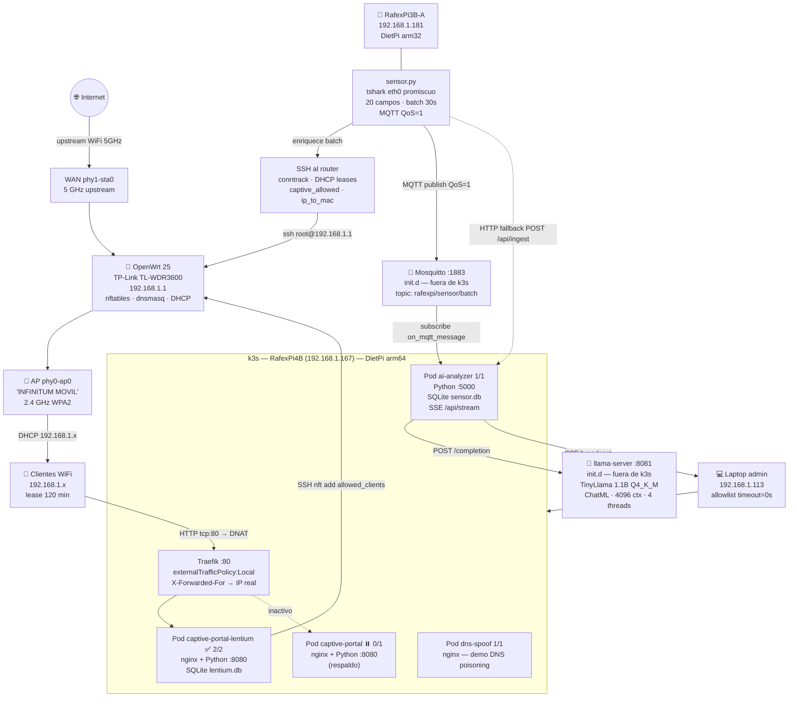

# Arquitectura del PoC — Captive Portal + IA Local en Red WiFi

> Documentación técnica detallada. Para la visión general dirigida a personas, ver [vision-general.md](vision-general.md).

## Diagrama de arquitectura



## Visión general (texto)

PoC educativo de seguridad en redes públicas que combina hardware real (Raspberry Pi 3B + 4B + router OpenWrt) con un LLM local. El sistema captura tráfico de red real, lo analiza con TinyLlama en batches y lo presenta en dashboards en vivo.

```
Internet
    │
    ▼
Router OpenWrt 25.12.2  (192.168.1.1)   ath79/mips_24kc
    │
    │  nftables tabla ip captive:
    │    set allowed_clients {
    │      flags dynamic, timeout
    │      timeout 120m                    ← clientes WiFi: 2 horas
    │      elements = {
    │        192.168.1.113 timeout 0s,    ← admin: nunca expira
    │        192.168.1.167 timeout 0s,    ← RafexPi4B: nunca expira
    │        192.168.1.181 timeout 0s,    ← RafexPi3B: nunca expira
    │      }
    │    }
    │  dnsmasq:
    │    • dominios captive portal → 192.168.1.167
    │    • captive.localhost.com → 192.168.1.167
    │    • DHCP option 114 → http://192.168.1.167/portal
    │    • DHCP lease time: 120m
    │    • Reservas permanentes:
    │        RafexPi4B  d8:3a:dd:4d:4b:ae → 192.168.1.167  infinite
    │        RafexPi3B  b8:27:eb:5a:ec:33 → 192.168.1.181  infinite
    │
    ├── WAN:  phy1-sta0  → WiFi upstream (5 GHz)
    └── AP:   phy0-ap0   → WiFi "INFINITUM MOVIL" (2.4 GHz)
                │
                │  clientes WiFi (192.168.1.x)
                │  DNAT HTTP → 192.168.1.167:80 si no autorizados
                │
                ▼
    ┌───────────────────────────────────────────────────────┐
    │   RafexPi4B — 192.168.1.167  (Raspberry Pi 4B)       │
    │   DietPi Debian trixie arm64 + k3s v1.34.6+k3s1      │
    │                                                       │
    │   Servicios init.d:                                   │
    │     mosquitto :1883   MQTT broker                     │
    │       topic: rafexpi/sensor/batch                     │
    │       persistence: /var/lib/mosquitto/                │
    │     llama-server :8081   TinyLlama 1.1B Q4_K_M        │
    │       ctx-size=4096  threads=4  --parallel 1          │
    │       endpoint: POST /completion  (ChatML)            │
    │                                                       │
    │   Traefik 3.6.10 (LoadBalancer :80)                   │
    │     externalTrafficPolicy: Local                      │
    │                                                       │
    │   Pod captive-portal-lentium (2/2)  ← ACTIVO           │
    │     [portal]   nginx:alpine :80                       │
    │       set_real_ip_from 10.42.0.0/16                   │
    │       proxy_pass al backend para /portal /api/ /accept│
    │     [backend]  captive-backend-lentium :8080          │
    │       GET /portal  → portal.html (Lentium)            │
    │       POST /api/register/client → SQLite + nft        │
    │       POST /api/register/guest  → SQLite + nft        │
    │       POST /accept → compatibilidad portal clásico    │
    │       GET /api/registros/clientes|invitados            │
    │       SQLite /data/lentium.db                         │
    │         clientes: telefono, pwd_plano, pwd_hash, ip   │
    │         invitados: nombre, apellidos, telefono,        │
    │                   dirección OSM, pwd_plano, pwd_hash,  │
    │                   redes_sociales, ip                   │
    │                                                       │
    │   Pod captive-portal (0/1) ← RESPALDO (réplicas=0)   │
    │     [portal]   nginx:alpine :80                       │
    │     [backend]  captive-backend :8080                  │
    │       POST /accept → SSH+nft al router (clásico)      │
    │                                                       │
    │   Pod ai-analyzer (1/1)                               │
    │     python:3.13-alpine3.23 :5000                      │
    │     MQTT subscriber → SQLite queue → worker thread    │
    │     Worker: llama-server :8081 (1 análisis a la vez)  │
    │     SQLite: /opt/analyzer/data/sensor.db              │
    │       batches: id, received_at, sensor_ip, status, payload  │
    │       analyses: id, batch_id, timestamp, risk,        │
    │                 analysis, elapsed_s, suspicious_count │
    │     GET  /dashboard   UI visual (HTML desde imagen)   │
    │     GET  /terminal    log SSE en vivo                 │
    │     GET  /api/history /api/stats /api/queue           │
    │     POST /api/ingest  (HTTP fallback del sensor)      │
    │     GET  /health                                      │
    │                                                       │
    │   Pod dns-spoof (1/1)  nginx:alpine                   │
    │     Demo separada de DNS poisoning                    │
    │     Ingress: Host rafex.dev / www.rafex.dev           │
    │                                                       │
    │   hostPath volumes:                                   │
    │     /opt/keys/captive-portal          → ambos portals │
    │     /opt/captive-portal/lentium-data/ → lentium DB    │
    │     /opt/analyzer/data/               → ai-analyzer   │
    └───────────────────────────────────────────────────────┘
                ▲  MQTT publish QoS=1 (rafexpi/sensor/batch)
                │  HTTP POST /api/ingest (fallback)
                │
    ┌───────────────────────────────────────────────────────┐
    │   RafexPi3B — 192.168.1.181  (Raspberry Pi 3B)       │
    │   DietPi + tshark + Python 3 + paho-mqtt             │
    │                                                       │
    │   /etc/init.d/network-sensor                          │
    │     tshark -i eth0 (promiscuo)                       │
    │       18 campos tab-separated:                        │
    │       frame.time_epoch, ip.src, ip.dst, ip.proto,    │
    │       tcp/udp.srcport, tcp/udp.dstport, frame.len,   │
    │       tcp.flags, dns.qry.name, http.host, ...        │
    │     TrafficAggregator (30s):                          │
    │       • stats por IP (packets, bytes, ports)          │
    │       • detección escaneo de puertos (>50 dst ports)  │
    │       • top talkers, top dst ports, protocolos        │
    │       • DNS queries, HTTP hosts                       │
    │     SSH opcional al router:                           │
    │       conntrack (conexiones activas)                  │
    │       /tmp/dhcp.leases (dispositivos en la red)       │
    │       nft list set (clientes autorizados)             │
    │     Publica batch JSON cada 30s → MQTT                │
    │     Fallback HTTP si MQTT no disponible               │
    │                                                       │
    │   /opt/keys/sensor  (SSH al router, opcional)         │
    └───────────────────────────────────────────────────────┘

    Laptop admin  (192.168.1.113)
      NUNCA bloqueada — timeout 0s permanente en allowed_clients
```

---

## Flujo completo — cliente WiFi nuevo (portal Lentium)

> Versión detallada con diagrama en [portales.md](portales.md).

```
1. Cliente conecta al WiFi "INFINITUM MOVIL"
        ↓
2. DHCP le asigna IP 192.168.1.x  (lease 120 minutos)
        ↓
3. SO detecta captive portal:
   GET http://connectivitycheck.gstatic.com/generate_204
        ↓  dnsmasq → 192.168.1.167
        ↓  DHCP option 114 anuncia URL captive
        ↓  nftables DNAT tcp dport 80 → 192.168.1.167:80
        ↓
4. Traefik (externalTrafficPolicy:Local) recibe con IP real del cliente
        ↓
5. nginx extrae IP real de X-Forwarded-For → $remote_addr = 192.168.1.X
        ↓
6. nginx redirige GET /generate_204 → 302 http://192.168.1.167/portal
        ↓
7. Cliente ve el portal Lentium (portal.html — marca Lentium/Tortugatel/Buffercel)
        │
        ├── Tab "Soy Cliente": teléfono + contraseña
        │         ↓  POST /api/register/client
        │
        └── Tab "Soy Invitado": nombre, apellidos, teléfono,
                  dirección OSM (Nominatim autocomplete),
                  contraseña, redes sociales (≥1)
                        ↓  POST /api/register/guest
        ↓
8. backend Python:
   - Guarda en SQLite: pwd_plano (texto claro) + pwd_hash (SHA-256)
   - SSH al router → nft add element allowed_clients { 192.168.1.X }
        ↓
9. Cliente navega libremente (timeout 120m en el set)
        ↓
10. Tras 120 min: elemento expira + lease DHCP expira → vuelve al portal
```

---

## Flujo de análisis IA

```
RafexPi3B (tshark captura tráfico eth0 cada 30s)
        ↓  MQTT publish rafexpi/sensor/batch  QoS=1
Router Mosquitto :1883
        ↓
ai-analyzer suscrito → on_mqtt_message()
        ↓
SQLite: INSERT batch (status=pending)
enqueue_batch(batch_id) → work_queue.put()
        ↓
worker_thread() [único] toma batch_id
        ↓
db_set_status(batch_id, "processing")
        ↓
build_prompt(summary):
  "Red WiFi — ultimos 30s:
   Paquetes:N (Xpps) Trafico:Ybytes
   Protocolos: tcp/N udp/N ...
   Top emisores: 192.168.1.X/N ...
   Top puertos dst: 80/N 443/N ...
   Dispositivos LAN: hostname/ip ...
   DNS: domain.com ...
   Alertas: scan/192.168.1.X ...

   Da un analisis de seguridad en 3 puntos
   breves e indica el riesgo (BAJO/MEDIO/ALTO)."
        ↓
POST http://192.168.1.167:8081/completion
  (TinyLlama 1.1B, ChatML, ~350 tokens prompt + 384 predict)
        ↓
Extrae riesgo (BAJO/MEDIO/ALTO) de la respuesta
        ↓
SQLite: INSERT analyses + UPDATE batch status=done
        ↓
SSE /api/stream → terminal.html en tiempo real
```

---

## Componentes de red — nftables en OpenWrt

```nft
table ip captive {
    set allowed_clients {
        type ipv4_addr
        flags dynamic, timeout
        timeout 120m                        # clientes WiFi: 2 horas
        elements = {
            192.168.1.113 timeout 0s,      # admin — nunca expira
            192.168.1.167 timeout 0s,      # RafexPi4B (portal) — nunca expira
            192.168.1.181 timeout 0s,      # RafexPi3B (sensor) — nunca expira
        }
    }

    # Redireccion HTTP: matching por subred (NO por interfaz)
    chain prerouting {
        type nat hook prerouting priority dstnat; policy accept;
        ip daddr 192.168.1.167 accept                   # ya va al portal
        ip saddr @allowed_clients accept                 # autorizado
        ip saddr 192.168.1.0/24 tcp dport 80 dnat to 192.168.1.167:80
    }

    # Bloqueo de forward — priority filter - 1 (antes que fw4)
    chain forward_captive {
        type filter hook forward priority filter - 1; policy accept;
        ip saddr != 192.168.1.0/24 accept              # tráfico externo: pasar
        ip saddr 192.168.1.113 accept                  # admin
        ip saddr 192.168.1.167 accept                  # RafexPi4B
        ip daddr 192.168.1.167 accept                  # hacia portal
        ip saddr 192.168.1.181 accept                  # RafexPi3B
        udp dport { 67, 68 } accept                    # DHCP
        tcp dport 53 accept                            # DNS
        udp dport 53 accept
        ip saddr @allowed_clients accept               # clientes autorizados
        ip saddr 192.168.1.0/24 drop                   # resto: bloqueado
    }
}
```

---

## SQLite — esquema de persistencia

```sql
-- Batches recibidos del sensor
CREATE TABLE batches (
    id          TEXT PRIMARY KEY,
    received_at TEXT NOT NULL,
    sensor_ip   TEXT,
    status      TEXT DEFAULT 'pending',   -- pending | processing | done | error
    payload     TEXT NOT NULL             -- JSON del resumen de tráfico
);

-- Análisis producidos por TinyLlama
CREATE TABLE analyses (
    id                INTEGER PRIMARY KEY AUTOINCREMENT,
    batch_id          TEXT REFERENCES batches(id),
    timestamp         TEXT NOT NULL,
    risk              TEXT,               -- BAJO | MEDIO | ALTO
    analysis          TEXT,              -- respuesta del LLM
    elapsed_s         REAL,              -- segundos que tardó el LLM
    suspicious_count  INTEGER,
    packets           INTEGER,
    bytes_fmt         TEXT
);
```

---

## Componentes k8s en RafexPi4B

| Recurso | Tipo | Detalle |
|---|---|---|
| `captive-portal` | Deployment | 1 réplica, 2 contenedores (nginx + captive-backend) |
| `captive-portal` | Service | ClusterIP ports 80 + 8080 |
| `captive-portal` | Ingress | Traefik → puerto 80 path `/` |
| `captive-portal-nginx-conf` | ConfigMap | nginx.conf + index.html + accepted.html |
| `traefik` | HelmChartConfig | `externalTrafficPolicy:Local` + `forwardedHeaders.insecure` |
| `ai-analyzer` | Deployment | 1 réplica, python:3.13-alpine3.23 |
| `ai-analyzer` | Service | ClusterIP port 5000 |
| `ai-analyzer` | Ingress | `/dashboard`, `/terminal`, `/api/*`, `/health` |
| `dns-spoof` | Deployment | nginx:alpine — demo separada |
| `dns-spoof` | Service | ClusterIP port 80 |
| `dns-spoof` | Ingress | `Host: rafex.dev` y `Host: www.rafex.dev` |

---

## Operación y logs

- Los scripts setup modulares guardan log en `/var/log/demo-openwrt/<componente>`.
- Si no hay permisos en `/var/log`, usan fallback `/tmp/demo-openwrt/<componente>`.
- Formato: `<script>-YYYYMMDD-HHMMSS.log`.
- Inventario de vistas HTML (conteo/rutas/propósito): `docs/html-endpoints.md`.

---

## Por qué matching por subred y no por interfaz

En OpenWrt los clientes WiFi se agregan al bridge `br-lan`. El kernel ve el tráfico
con `iifname = "br-lan"` en el hook forward, **no** `"phy0-ap0"`. Si las reglas usan
`iifname "phy0-ap0"` nunca hacen match y todo pasa libre.

Solución: `ip saddr 192.168.1.0/24` — identifica todos los clientes sin importar cómo lleguen.

---

## Por qué externalTrafficPolicy: Local en Traefik

Con `Cluster` (default), kube-proxy hace SNAT y la IP real del cliente (192.168.1.X)
se reemplaza por la IP del gateway CNI (10.42.0.1). Con `Local`, kube-proxy no hace
SNAT y Traefik recibe la IP real directamente. En un cluster de 1 nodo no hay desventajas.

---

## Por qué python:3.13-alpine3.23 en ai-analyzer

La base estándar del repo para imágenes Python es `python:3.13-alpine3.23`.

`python:3.11-slim` (Debian) + crun (runtime de contenedores de podman) intenta conectar
a sd-bus (D-Bus/systemd). DietPi no usa systemd como PID 1 — falla con
`sd-bus: No such file or directory`. Alpine no tiene esa dependencia.

---

## Por qué HTML dentro de la imagen y no en ConfigMap

Los archivos `dashboard.html` y `terminal.html` contienen JavaScript con literales de objeto
(`{}`), template strings y caracteres especiales. `kubectl apply` parsea el YAML con un parser
estricto que falla al encontrar esos patrones embebidos en `data:` de un ConfigMap.

Solución: copiar los HTML dentro de la imagen Docker y servirlos con `open().read()` en Python.

---

## Dispositivos

| Dispositivo | Hostname | IP | MAC | OS |
|---|---|---|---|---|
| Router OpenWrt | — | 192.168.1.1 | — | OpenWrt 25.12.2 (ath79/mips_24kc) |
| Raspberry Pi 4B | RafexPi4B | 192.168.1.167 | d8:3a:dd:4d:4b:ae | DietPi Debian trixie arm64 |
| Raspberry Pi 3B | RafexPi3B | 192.168.1.181 | b8:27:eb:5a:ec:33 | DietPi Debian arm |
| Laptop admin | — | 192.168.1.113 | — | — |

---

← [Portales](portales.md) | [Índice](../README.md) | [LLM →](llm.md)
