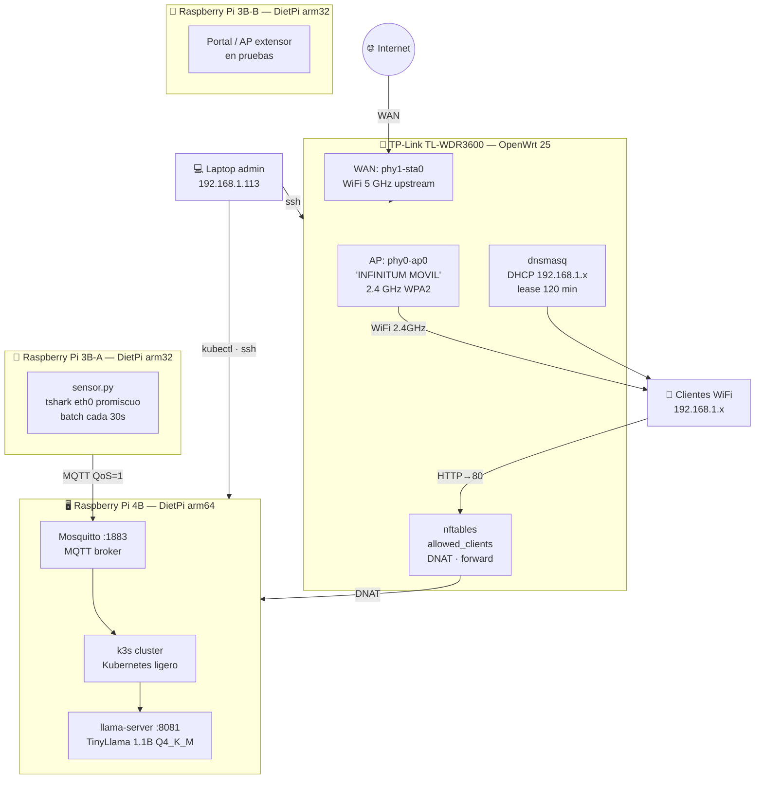

# Hardware — Los dispositivos del sistema

## Inventario

| # | Dispositivo | Modelo | IP | Sistema Operativo | Rol |
|---|---|---|---|---|---|
| 1 | **Router** | TP-Link TL-WDR3600 | 192.168.1.1 | OpenWrt 25.x (ath79/mips_24kc) | Puerta de enlace, WiFi AP, firewall, DHCP |
| 2 | **RafexPi4B** | Raspberry Pi 4B (8 GB RAM) | 192.168.1.167 | DietPi (Debian Trixie arm64) | Servidor principal — k3s, LLM, portal, analizador |
| 3 | **RafexPi3B-A** | Raspberry Pi 3B (1 GB RAM) | 192.168.1.181 | DietPi (Raspberry Pi OS arm32) | Sensor de red — tshark, captura y envía batches |
| 4 | **RafexPi3B-B** | Raspberry Pi 3B (1 GB RAM) | 192.168.1.182 | DietPi | Nodo de portal / extensión AP (en pruebas) |

**Laptop admin:** 192.168.1.113 — Siempre autorizada en el portal (timeout=0s permanente).

---

## Diagrama físico



---

## Router — TP-Link TL-WDR3600

| Atributo | Valor |
|---|---|
| **Firmware original** | TP-Link (obsoleto, sin actualizaciones) |
| **Firmware actual** | OpenWrt 25.x |
| **Arquitectura CPU** | ath79 / MIPS 24Kc |
| **Chipset WiFi** | Atheros AR9380 (2.4 GHz) + AR9580 (5 GHz) |
| **RAM** | 128 MB |
| **Flash** | 8 MB |
| **Puertos** | 1 WAN + 4 LAN GbE |
| **Por qué OpenWrt** | Control total, nftables, scripting, SSH, comunidad activa |

OpenWrt convierte un router que el fabricante abandonó en una plataforma de red completa.
El hardware de 2012 sigue siendo funcional y seguro en 2026 gracias al mantenimiento comunitario.

---

## RafexPi4B — Servidor principal

| Atributo | Valor |
|---|---|
| **Modelo** | Raspberry Pi 4B |
| **RAM** | 8 GB LPDDR4 |
| **CPU** | Cortex-A72 (ARM v8) 4 núcleos a 1.8 GHz |
| **Almacenamiento** | microSD 32 GB + pendrive para datos |
| **OS** | DietPi (Debian Trixie arm64) |
| **Conectividad** | Ethernet GbE + WiFi (no usado como AP) |

**Servicios init.d (fuera de k3s):**
- `mosquitto` :1883 — MQTT broker (recibe batches del sensor)
- `llama-server` :8081 — TinyLlama 1.1B Q4_K_M (4096 ctx, 4 hilos, sin GPU)

**Pods en k3s:**
- `captive-portal-lentium` (2/2) — Portal activo
- `captive-portal` (0/1) — Portal de respaldo
- `ai-analyzer` (1/1) — Analizador IA
- `dns-spoof` (1/1) — Demo DNS poisoning
- `traefik` — Ingress controller

---

## RafexPi3B-A — Sensor de red

| Atributo | Valor |
|---|---|
| **Modelo** | Raspberry Pi 3B |
| **RAM** | 1 GB LPDDR2 |
| **CPU** | Cortex-A53 (ARM v8) 4 núcleos a 1.2 GHz |
| **OS** | DietPi (Raspberry Pi OS arm32) |
| **Conectividad** | Ethernet 100 Mbps (captura en eth0) |

**Función:** Conectado al switch LAN del router, captura **todo el tráfico de la red WiFi**
en modo promiscuo. Agrega estadísticas cada 30 segundos y las publica vía MQTT.

El Raspi 3B es suficiente para esta tarea: tshark consume ~15% de CPU con tráfico normal.

---

## RafexPi3B-B — Nodo auxiliar

Segundo Raspi 3B en pruebas como nodo adicional del clúster o extensión del punto de acceso.
Actualmente en 192.168.1.182.

---

## MACs permanentes en el router

```
RafexPi4B:  d8:3a:dd:4d:4b:ae → 192.168.1.167  (reserva DHCP + allowlist timeout=0s)
RafexPi3B:  b8:27:eb:5a:ec:33 → 192.168.1.181  (reserva DHCP + allowlist timeout=0s)
Admin:      (dinámica)          → 192.168.1.113  (allowlist timeout=0s)
```

---

← [Visión general](vision-general.md) | [Índice](../README.md) | [Portales →](portales.md)
