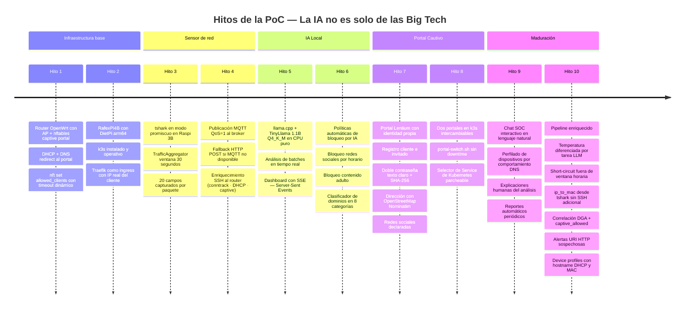

# Hitos — El camino de construcción de la PoC

## Línea de tiempo

---

## Detalle de cada hito

### Hito 1 — Router OpenWrt como base de control

**Qué se logró:**
- Flashear el TP-Link TL-WDR3600 con OpenWrt 25.x
- Configurar el AP WiFi ("INFINITUM MOVIL") y WAN upstream
- Implementar `nftables` con:
  - `set allowed_clients` con timeout dinámico de 120 minutos
  - `chain prerouting` con DNAT tcp:80 → portal
  - `chain forward_captive` bloqueando clientes no autorizados
- dnsmasq con DHCP option 114 (capive portal URL) y redirect DNS

**Por qué importa:** El router es la única forma de controlar acceso a internet. OpenWrt da acceso completo al firewall sin depender de firmware propietario.

---

### Hito 2 — Clúster k3s en Raspberry Pi 4B

**Qué se logró:**
- DietPi instalado en arm64 (Debian Trixie)
- k3s v1.34 (Kubernetes ligero) operativo en un solo nodo
- Traefik como ingress con `externalTrafficPolicy: Local` para preservar la IP real del cliente
- Mosquitto MQTT y llama-server como servicios init.d (fuera de k3s para persistencia)

**Por qué importa:** Kubernetes en una Raspberry Pi demuestra que la orquestación de contenedores no requiere un data center.

---

### Hito 3 — Sensor de red con tshark

**Qué se logró:**
- tshark capturando 20 campos por paquete en modo promiscuo
- `TrafficAggregator` agregando estadísticas en ventanas de 30 segundos
- Detección de: port scan, host scan, alto ancho de banda, puertos riesgosos

**Por qué importa:** Visibilidad del tráfico de red en tiempo real sin hardware especializado.

---

### Hito 4 — MQTT y enriquecimiento con datos del router

**Qué se logró:**
- Publicación de batches vía MQTT QoS=1 con fallback HTTP
- Enriquecimiento SSH al router: conntrack, DHCP leases, captive_allowed
- `ip_to_mac` capturado desde `eth.src` de tshark (sin SSH adicional)

**Por qué importa:** El batch llega al analizador con contexto completo: qué dispositivo (por hostname DHCP), si está autorizado en el portal, y su MAC.

---

### Hito 5 — LLM local en CPU

**Qué se logró:**
- llama.cpp compilado para arm64
- TinyLlama 1.1B Q4_K_M (~640 MB) corriendo en CPU puro
- Pipeline completo: MQTT → SQLite → LLM → SSE → dashboard
- Análisis de seguridad en ~10-30 segundos por batch

**Por qué importa:** Este es el núcleo de la demostración. IA real, localmente, en hardware de $60.

---

### Hito 6 — Políticas automáticas decididas por IA

**Qué se logró:**
- Detección de tráfico a redes sociales por horario
- LLM decide block/unblock en formato JSON estricto
- Short-circuit fuera de ventana horaria (sin llamar al LLM)
- Bloqueo de contenido adulto por heurística de dominios
- Clasificador de 8 categorías de tráfico

**Por qué importa:** El LLM no solo analiza — actúa. Reglas dinámicas ejecutadas en el router.

---

### Hito 7 — Portal Lentium completo

**Qué se logró:**
- Portal con identidad y humor (Lentium/Tortugatel/Buffercel)
- Dos flujos de registro: cliente (teléfono+contraseña) e invitado (formulario completo)
- Almacenamiento dual de contraseñas (texto claro + SHA-256) como demostración pedagógica
- Autocompletado de dirección con OpenStreetMap Nominatim (sin Google Maps)
- Declaración de redes sociales con validación de al menos una

**Por qué importa:** Portal listo para producción con datos reales de los usuarios.

---

### Hito 8 — Intercambio de portales sin downtime

**Qué se logró:**
- Dos deployments en k3s con label `portal-variant`
- `portal-switch.sh`: scale-up nuevo → esperar rollout → patch Service → scale-down viejo
- Protección contra activar el portal ya activo

**Por qué importa:** Flexibilidad operacional. Demostración de Kubernetes como herramienta real.

---

### Hito 9 — Chat SOC y perfilado de dispositivos

**Qué se logró:**
- Chat interactivo: preguntas en español sobre el estado de la red
- Caché de contexto 30 s para no repetir queries DB por cada pregunta
- Perfilado de dispositivos por patrones DNS/HTTP/TLS: móvil, laptop, IoT, servidor
- Device profiles enriquecidos con hostname DHCP y MAC

**Por qué importa:** La IA se vuelve accesible para usuarios no técnicos.

---

### Hito 10 — Pipeline enriquecido (mejoras al sensor y analizador)

**Qué se logró (11 mejoras simultáneas):**

| Mejora | Archivo | Beneficio |
|---|---|---|
| Prompt enriquecido ~180 tokens | analyzer.py | LLM ve hostnames, clientes top, HTTP requests |
| Temperatura diferenciada por tarea | analyzer.py | Análisis más preciso, chat más natural |
| Short-circuit política social | analyzer.py | ~1920 llamadas LLM evitadas por noche |
| Caché de clasificación de dominios | analyzer.py | TTL 300s reduce round-trips a SQLite |
| Filtro IPs sistema en risky_port | sensor.py | Elimina falsos positivos permanentes |
| Detección URI HTTP sospechosas | sensor.py | 5 patrones regex: SQLi, traversal, shell... |
| ip_to_mac desde tshark | sensor.py | MAC sin SSH extra al router |
| Device profiles con hostname+MAC | analyzer.py | Perfiles más identificables |
| Caché contexto chat | analyzer.py | TTL 30s reduce latencia |
| Alertas DGA + captive correladas | analyzer.py | critical si IP no autorizada |
| Ventana adaptativa summary worker | analyzer.py | 2-10 batches según carga |

---

← [Software libre](software-libre.md) | [Índice](../README.md)
