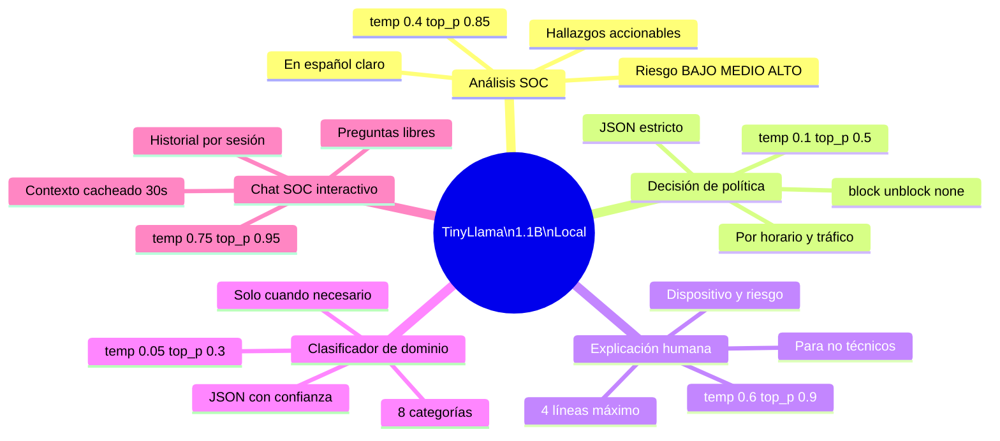
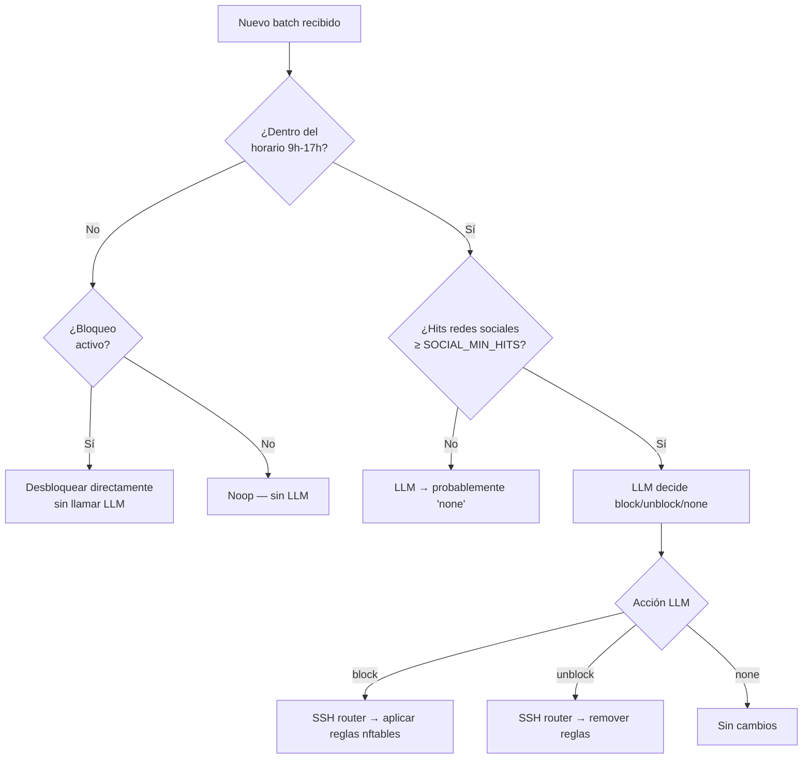

# Analizador IA y LLM — Inteligencia artificial local

## El modelo: TinyLlama 1.1B Q4_K_M

| Atributo | Valor |
|---|---|
| **Nombre** | TinyLlama 1.1B |
| **Cuantización** | Q4_K_M (4 bits por peso) |
| **Tamaño en disco** | ~640 MB |
| **Uso de RAM** | ~800 MB (con contexto cargado) |
| **Arquitectura** | LLaMA 2 (transformer decoder) |
| **Parámetros** | 1.1 mil millones |
| **Contexto máximo** | 4096 tokens |
| **Formato de prompt** | ChatML |
| **Motor de inferencia** | llama.cpp (C++, sin GPU, CPU puro) |
| **Velocidad en Pi 4B** | ~3–8 tokens/segundo |
| **Endpoint** | `POST http://192.168.1.167:8081/completion` |
| **Licencia del modelo** | Apache 2.0 |
| **Licencia de llama.cpp** | MIT |

El modelo corre **completamente en local**, en el CPU de la Raspberry Pi 4B, con 4 hilos.
Sin GPU, sin conexión a internet, sin telemetría, sin costos por token.

---

## Los 5 casos de uso del LLM



---

## Caso 1 — Análisis SOC (cada batch de 30 segundos)

**Quién lo invoca:** `analyze_and_store()` en el worker thread  
**Temperatura:** 0.4 — determinista pero con algo de variabilidad  
**Prompt de entrada (~180 tokens):**

```
[SYSTEM] Analista SOC de seguridad WiFi. Responde en español claro.

[USER]
Eres analista SOC para red WiFi pública.
Analiza este resumen de tráfico:

WiFi 30s: pkt=1247 pps=41.6 bytes=2.1 MB
Proto:TCP:892,UDP:312,ICMP:43
IPs:192.168.1.5(laptop-jose),192.168.1.12,192.168.1.8
Ports:443,80,53,8080
DNS:youtube.com,google.com,instagram.com,tiktok.com
Alertas:[HIGH_BANDWIDTH]192.168.1.5
Clientes_top:192.168.1.5(laptop-jose)→youtube.com×24,google.com×8,instagram.com×3
Portal_autorizados:4
HTTP_req:GET http://192.168.1.1/admin; POST http://example.com/wp-login.php

Responde en español con:
1) Riesgo (BAJO/MEDIO/ALTO)
2) 2-3 hallazgos accionables
3) Recomendación breve.
```

**Salida esperada:**
```
RIESGO: MEDIO

1. IP 192.168.1.5 (laptop-jose) genera 2.1 MB en 30s (>5 Mbps) — posible descarga masiva
   o streaming. Monitorear si persiste.
2. Se detectan peticiones a /admin y /wp-login.php — posible escaneo automático o malware.
3. Tráfico a TikTok e Instagram en horario laboral — revisar política de acceso.

Recomendación: aplicar límite de banda a 192.168.1.5 y revisar logs del router.
```

---

## Caso 2 — Decisión de política social

**Quién lo invoca:** `evaluate_and_apply_social_policy()`  
**Temperatura:** 0.1 — casi determinista, decisión crítica  
**Short-circuit:** si está fuera del horario (9h-17h por defecto), **no se llama al LLM**



**Salida JSON esperada del LLM:**
```json
{"action": "block", "reason": "tráfico Instagram y TikTok detectado en horario laboral"}
```

---

## Caso 3 — Explicación humana

**Quién lo invoca:** `build_human_explanation()`  
**Temperatura:** 0.6 — balance entre precisión y lenguaje natural  
**Propósito:** Traducir el análisis técnico a lenguaje comprensible para cualquier persona

**Salida ejemplo:**
```
La red está siendo usada principalmente por un dispositivo llamado "laptop-jose" que está
viendo videos (YouTube) y redes sociales. La actividad es moderada. Se detectó un intento
de acceso a la página de administración del router — podría ser automático pero vale vigilarlo.
Riesgo general: MEDIO.
```

---

## Caso 4 — Clasificador de dominios

**Quién lo invoca:** `_llm_domain_category()` (solo si `FEATURE_DOMAIN_CLASSIFIER_LLM=true`)  
**Temperatura:** 0.05 — altamente determinista  
**Nota:** Por defecto deshabilitado. Las 8 categorías se asignan por heurística primero.

| Categoría | Ejemplos |
|---|---|
| `infraestructura` | cloudflare.com, amazonaws.com, akamai |
| `redes_sociales` | facebook.com, instagram.com, tiktok.com |
| `streaming` | youtube.com, netflix.com, spotify.com |
| `desarrollo` | github.com, pypi.org, npmjs.com |
| `mensajeria` | whatsapp.com, telegram.org, signal.org |
| `productividad` | office.com, google.com, notion.so |
| `adulto` | dominios en lista negra |
| `otros` | todo lo que no coincide |

**Caché en memoria:** TTL 300 s para no repetir clasificaciones de dominios frecuentes.

---

## Caso 5 — Chat SOC interactivo

**Quién lo invoca:** petición HTTP `POST /api/chat`  
**Temperatura:** 0.75 — respuestas más naturales y variadas  
**Contexto:** resumen de red + alertas recientes + categorías de tráfico + perfiles de dispositivos

```
Usuario: ¿Hay algún dispositivo sospechoso en la red ahora?

LLM: Sí, hay un dispositivo en 192.168.1.42 que consultó 12 dominios distintos
en los últimos 30 segundos, incluyendo patrones con nombres aleatorios que sugieren
actividad DGA (generación algorítmica de dominios). Además, su IP no aparece en la
lista de clientes autorizados del portal cautivo. Recomiendo investigarlo.
```

---

## Pipeline completo del analizador

```mermaid
flowchart LR
    MQTT["MQTT\nrafexpi/sensor/batch"] --> onmsg["on_mqtt_message()"]
    onmsg --> sqlite_b["SQLite\nbatches status=pending"]
    sqlite_b --> queue["work_queue\nQueue de IDs"]
    queue --> worker["worker_thread\nuno a la vez"]

    worker --> anal["Análisis SOC\ntemp=0.4"]
    worker --> pol["Política social\ntemp=0.1"]
    worker --> hum["Explicación humana\ntemp=0.6"]
    worker --> class["Clasificador\ntemp=0.05"]
    worker --> dev["Perfilado dispositivos\nsin LLM"]
    worker --> alert["Detección alertas\nsin LLM"]

    anal --> sqlite_a["SQLite analyses\nrisk · analysis · elapsed_s"]
    sqlite_a --> sse["SSE /api/stream"]
    sse --> dash["Dashboard\n/dashboard"]
    sse --> term["Terminal\n/terminal"]
    sse --> chat["Chat\n/api/chat"]
```

---

## Alertas generadas (sin LLM)

El analizador también genera alertas **sin usar el LLM** mediante reglas deterministas:

| Tipo | Condición | Severidad |
|---|---|---|
| `many_distinct_domains` | >25 dominios distintos en 30s | medium/high |
| `repeated_domain_queries` | Un dominio >12 consultas, >45% del total | medium |
| `rare_domain_pattern` | Dominio con TLD inusual o patrón DGA | high |
| `dga_suspicious_client` | DGA desde IP no autorizada en portal | **critical** |
| `suspicious_http_request` | URI con patrón de inyección/traversal/shell | high |
| `sensor_port_scan` | >15 puertos distintos desde una IP | medium |
| `sensor_host_scan` | >20 hosts distintos desde una IP | medium |
| `sensor_high_bandwidth` | >5 Mbps desde una IP | medium |
| `sensor_risky_port` | Puerto 22/23/3389/445/etc. con >5 hits | medium |

---

← [Portales](portales.md) | [Índice](../README.md) | [Software libre →](software-libre.md)
