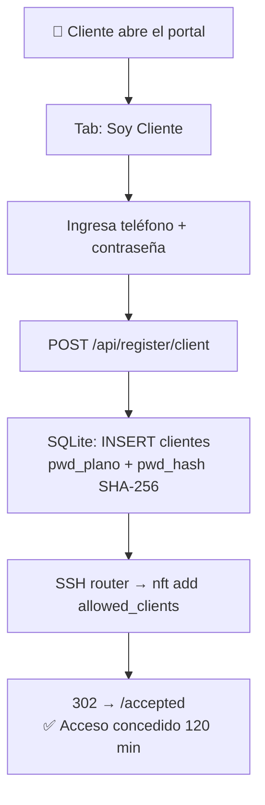
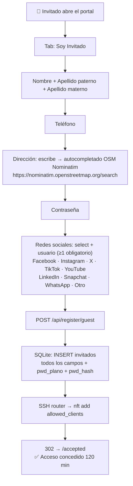
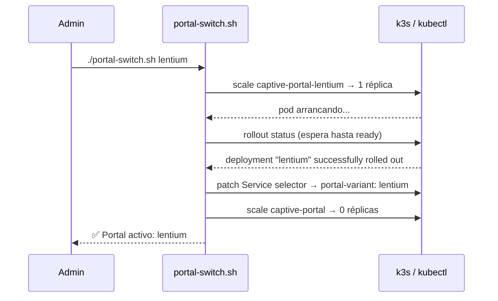

# Portales cautivos — Los dos portales del sistema

El sistema tiene **dos portales cautivos** desplegados como pods de Kubernetes en el clúster k3s.
Solo uno está activo a la vez. El intercambio es sin downtime.

---

## Comparativa

| Característica | Portal Lentium | Portal Clásico |
|---|---|---|
| **Estado** | ✅ ACTIVO (2/2 réplicas) | ⏸️ RESPALDO (0/1 réplicas) |
| **Marca** | Lentium / Tortugatel / Buffercel | — |
| **Slogan** | "Exceso de Latencia" | — |
| **Registro** | Dos flujos: Cliente e Invitado | Ninguno |
| **Datos guardados** | SQLite con perfil completo | Solo IP + estado |
| **Contraseñas** | pwd_plano + pwd_hash SHA-256 | No aplica |
| **Dirección** | Autocompletado OpenStreetMap | No aplica |
| **Redes sociales** | Declaradas (≥1 para invitados) | No aplica |
| **Endpoint** | `/api/register/client` `/api/register/guest` | `/accept` |

---

## Portal Lentium — El portal principal

### Identidad y humor

El portal tiene identidad propia como chiste de la telecomunicación mexicana:

| Elemento | Original (referencia) | Lentium |
|---|---|---|
| Marca | Infinitum | **Lentium** |
| Operadora móvil | Telcel | **Tortugatel** |
| Operadora fija | Telmex | **Buffercel** |
| Alerta | "Exceso de velocidad" | **"Exceso de Latencia"** |

### Flujo de registro — Cliente

Para usuarios que ya tienen cuenta:



### Flujo de registro — Invitado

Para usuarios nuevos sin cuenta:



### Esquema SQLite del portal Lentium

```sql
CREATE TABLE IF NOT EXISTS clientes (
    id            INTEGER PRIMARY KEY AUTOINCREMENT,
    telefono      TEXT NOT NULL,
    pwd_plano     TEXT NOT NULL,       -- contraseña en texto claro
    pwd_hash      TEXT NOT NULL,       -- SHA-256 de la contraseña
    ip            TEXT,
    registrado_en TEXT,
    ultima_sesion TEXT
);

CREATE TABLE IF NOT EXISTS invitados (
    id                  INTEGER PRIMARY KEY AUTOINCREMENT,
    nombre              TEXT NOT NULL,
    apellido_paterno    TEXT NOT NULL,
    apellido_materno    TEXT NOT NULL,
    telefono            TEXT NOT NULL,
    direccion_texto     TEXT,          -- texto libre del usuario
    direccion_geo       TEXT,          -- JSON del resultado Nominatim
    pwd_plano           TEXT NOT NULL,
    pwd_hash            TEXT NOT NULL,
    redes_sociales      TEXT,          -- JSON: [{red, usuario}, ...]
    ip                  TEXT,
    registrado_en       TEXT,
    ultima_sesion       TEXT
);
```

> **Nota sobre las contraseñas:** Se almacenan en dos columnas por diseño pedagógico.
> En producción real solo se guardaría el hash. La columna `pwd_plano` sirve para
> demostrar en la presentación la diferencia entre almacenamiento seguro e inseguro.

### Autocompletado de dirección con OpenStreetMap

El campo de dirección usa la API pública de **Nominatim** (OpenStreetMap) para autocompletar:

```javascript
// Sin Google Maps, sin API key, sin costo
fetch(`https://nominatim.openstreetmap.org/search?q=${encodeURIComponent(query)}&format=json&limit=5`)
```

---

## Intercambio de portales



```bash
# Comandos disponibles
./scripts/portal-switch.sh lentium    # activar Lentium
./scripts/portal-switch.sh clasico    # activar clásico
./scripts/portal-switch.sh            # alternar automáticamente
./scripts/portal-switch.sh status     # ver cuál está activo
```

El script protege contra:
- Activar el portal que ya está activo (abort)
- Fallos en el rollout (timeout con abort)

---

## Endpoints del Portal Lentium

| Método | Ruta | Descripción |
|---|---|---|
| `GET` | `/portal` | Sirve `portal.html` — formulario de registro |
| `POST` | `/api/register/client` | Registra cliente (teléfono + contraseña) |
| `POST` | `/api/register/guest` | Registra invitado (formulario completo) |
| `GET` | `/accepted` | Página de bienvenida tras el registro |
| `POST` | `/accept` | Compatibilidad con el portal clásico |
| `GET` | `/health` | Estado del servicio |
| `GET` | `/api/registros/clientes` | Lista de clientes registrados (admin) |
| `GET` | `/api/registros/invitados` | Lista de invitados registrados (admin) |

---

← [Hardware](hardware.md) | [Índice](../README.md) | [Arquitectura →](arquitectura.md)
