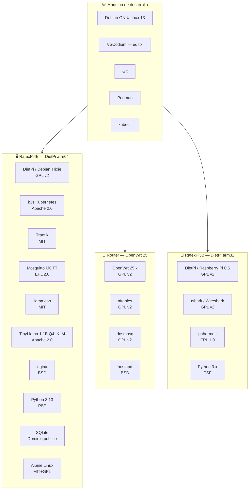

# Software libre — El stack completo de la PoC

> Desde el editor de código hasta el firmware del router, pasando por el sistema operativo,
> el motor de IA y cada librería utilizada — **todo es software libre y de código abierto**.

---

## La máquina gestora — donde se desarrolló todo

| Software | Versión | Uso | Licencia |
|---|---|---|---|
| **Debian GNU/Linux 13 "Trixie"** | 13.x | Sistema operativo del equipo de desarrollo | GPL v2 + varios |
| **VSCodium** | 1.x | Editor de código (VS Code sin telemetría de Microsoft) | MIT |
| **Git** | 2.x | Control de versiones | GPL v2 |
| **Podman** | 5.x | Build de imágenes de contenedor (estable en Debian 13) | Apache 2.0 |
| **kubectl** | 1.34 | Administración del clúster k3s remoto | Apache 2.0 |
| **OpenSSH client** | 9.x | Acceso SSH al router y a las Raspis | BSD |
| **Python 3.13** | 3.13 | Scripts de automatización y desarrollo | PSF License |
| **bash** | 5.x | Scripts de despliegue y operación | GPL v3 |

> **VSCodium vs VS Code:** VSCodium es el binario de VS Code compilado desde el código fuente
> oficial de Microsoft pero sin telemetría, sin tracking y sin binarios propietarios incluidos.
> Misma experiencia, sin el rastreo. Disponible en https://vscodium.com

---

## Sistema operativo — dispositivos de la PoC

| Dispositivo | OS | Versión | Arquitectura | Licencia |
|---|---|---|---|---|
| TP-Link TL-WDR3600 | **OpenWrt** | 25.x | ath79 / MIPS 24Kc | GPL v2 |
| RafexPi4B | **DietPi** (base Debian Trixie) | arm64 | ARMv8 Cortex-A72 | GPL v2 + Debian |
| RafexPi3B-A | **DietPi** (base Raspberry Pi OS) | arm32 | ARMv7 Cortex-A53 | GPL v2 |
| RafexPi3B-B | **DietPi** (base Raspberry Pi OS) | arm32 | ARMv7 Cortex-A53 | GPL v2 |

---

## Stack completo por capa

---

## Tabla completa de software

### Infraestructura y red

| Software | Función en la PoC | Licencia | URL |
|---|---|---|---|
| **OpenWrt 25** | Firmware del router, AP WiFi, firewall | GPL v2 | openwrt.org |
| **nftables** | Firewall, captive portal, bloqueo de dominios | GPL v2 | netfilter.org |
| **dnsmasq** | DHCP + DNS redirect + capive portal option 114 | GPL v2 | thekelleys.org.uk |
| **hostapd** | Punto de acceso WiFi 2.4 GHz | BSD | w1.fi |
| **wpa_supplicant** | Cliente WiFi WAN upstream | BSD | w1.fi |
| **OpenSSH** | Control remoto del router desde Python | BSD | openssh.com |

### Orquestación y contenedores

| Software | Función en la PoC | Licencia | URL |
|---|---|---|---|
| **k3s** | Kubernetes ligero en Raspberry Pi 4B | Apache 2.0 | k3s.io |
| **Traefik** | Ingress controller con preservación de IP real | MIT | traefik.io |
| **containerd** | Runtime de contenedores (integrado en k3s) | Apache 2.0 | containerd.io |
| **Alpine Linux** | Base de imágenes de contenedores del portal y nginx | MIT+GPL | alpinelinux.org |
| **Podman** | Build de imágenes en la máquina de desarrollo (estable en Debian 13) | Apache 2.0 | podman.io |

### Mensajería y comunicación entre servicios

| Software | Función en la PoC | Licencia | URL |
|---|---|---|---|
| **Mosquitto MQTT** | Broker de mensajes sensor → analizador | EPL 2.0 | mosquitto.org |
| **paho-mqtt** | Librería Python MQTT (publisher y subscriber) | EPL 1.0 | eclipse.dev/paho |

### Web y backend

| Software | Función en la PoC | Licencia | URL |
|---|---|---|---|
| **nginx** | Reverse proxy del portal cautivo | BSD 2-Clause | nginx.org |
| **Python 3.13** | Backend del portal, analizador IA, sensor | PSF License | python.org |
| **SQLite** | Base de datos local (portal + analizador) | Dominio público | sqlite.org |

### IA y modelo de lenguaje

| Software | Función en la PoC | Licencia | URL |
|---|---|---|---|
| **llama.cpp** | Motor de inferencia C++ para CPU | MIT | github.com/ggerganov/llama.cpp |
| **TinyLlama 1.1B** | Modelo LLM de análisis y decisiones | Apache 2.0 | huggingface.co/TinyLlama |
| **GGUF format** | Formato de cuantización Q4_K_M | MIT | — |

### Python — librerías

| Librería | Uso | Licencia |
|---|---|---|
| `paho-mqtt` | Cliente MQTT (sensor y analizador) | EPL 1.0 |
| `requests` | HTTP POST al LLM y al analizador | Apache 2.0 |
| `sqlite3` | ORM ligero (stdlib) | PSF |
| `hashlib` | SHA-256 de contraseñas | PSF |
| `zoneinfo` | Zonas horarias para políticas | PSF |
| `threading` | Worker thread, locks, eventos | PSF |
| `re` | Patrones regex para detección HTTP | PSF |

### Frontend

| Tecnología | Uso | Licencia |
|---|---|---|
| **HTML5** | Estructura del portal cautivo | W3C (abierto) |
| **CSS3** | Estilos del portal | — |
| **JavaScript vanilla** | Formularios, tabs, autocompletado OSM | — |
| **OpenStreetMap** | Datos cartográficos para autocompletado | ODbL |
| **Nominatim API** | Geocodificación de direcciones | ODbL |

### Herramientas de captura y análisis

| Herramienta | Uso | Licencia |
|---|---|---|
| **tshark** (Wireshark CLI) | Captura en modo promiscuo, 20 campos por paquete | GPL v2 |

---

## Costo total de licencias de software

**$0.00 USD**

Todo el software utilizado en esta PoC puede descargarse, usarse, modificarse y redistribuirse
de forma gratuita y legal. No hay licencias propietarias, no hay suscripciones, no hay
acuerdos de usuario que cedan tus datos.

---

## Reflexión — El poder del software libre

> *"Free software is a matter of liberty, not price."*
> — Richard Stallman, GNU Manifesto, 1985

---

Cuarenta años después del Manifiesto GNU, esta PoC es posible gracias a miles de personas
que eligieron publicar su trabajo bajo licencias libres. Cada pieza del stack tiene una historia:

**OpenWrt** nació cuando Linksys filtró accidentalmente el código fuente del WRT54G en 2003.
La comunidad lo tomó, lo mejoró y hoy mantiene firmware para cientos de modelos de router
que los fabricantes abandonaron. El hardware que muchos tiran a la basura sigue siendo útil
y seguro gracias a este esfuerzo colectivo.

**llama.cpp** empezó en enero de 2023 cuando Georgi Gerganov pasó un fin de semana
convirtiendo los pesos de LLaMA al formato GGML para correrlos en su MacBook.
En semanas, la comunidad lo portó a Windows, Linux, ARM, CUDA, Metal. Hoy es el motor
que democratiza la inferencia de LLMs en hardware modesto. Un desarrollador, código abierto,
impacto global medido en millones de instalaciones.

**TinyLlama** es el resultado de entrenamiento distribuido publicado abiertamente. El modelo
que analiza tráfico de red en esta PoC fue entrenado con recursos que ninguna universidad
pequeña podría costear — pero gracias a las licencias abiertas, cualquiera puede usarlo,
modificarlo y mejorarlo.

**VSCodium** existe porque a la comunidad le importó la diferencia entre código abierto y
software libre: el código fuente de VS Code es abierto, pero los binarios oficiales de Microsoft
incluyen telemetría y extensiones propietarias. VSCodium compila el mismo código sin ese bagaje.
Un principio técnicamente pequeño pero filosóficamente importante.

**Debian GNU/Linux 13** — la distribución donde se desarrolló todo esto — cumplirá 33 años
en 2026. Es posiblemente el proyecto de software colaborativo más longevo y exitoso de la
historia de la computación. Sin Debian no existiría Ubuntu, sin Ubuntu no existiría el
ecosistema de servidores Linux que corre el 90% de la infraestructura de internet.

---

### Lo que esta PoC dice sobre el estado del software libre en 2026

La IA generativa generó una narrativa de que este campo pertenece a las Big Tech.
OpenAI, Google, Anthropic y Meta concentran modelos, infraestructura y talento.

Pero el conocimiento, los algoritmos, los datos de entrenamiento y las herramientas
que hacen posible esa IA vienen mayoritariamente de la academia y la comunidad open source:
- El paper "Attention is All You Need" (transformers) es público
- Los pesos de LLaMA se filtraron y abrieron
- llama.cpp los hizo accesibles en hardware común
- La comunidad de Hugging Face distribuyó cientos de variantes

**El software libre no llegó tarde a la IA. Estuvo desde el principio.**

Esta Raspberry Pi con TinyLlama analizando tráfico de red en tiempo real no es un juguete.
Es una demostración de que el conocimiento acumulado durante décadas por la comunidad de
software libre es suficiente para construir sistemas inteligentes, seguros y privados.

Sin pagar un centavo a ninguna empresa. Sin ceder tus datos a ningún servidor externo.
Sin depender de que una empresa decida cuándo deprecar una API.

---

> **La próxima vez que alguien te diga "para eso necesitas la nube", muéstrale una Raspberry Pi
> con TinyLlama analizando tráfico de red en tiempo real.**
>
> **La IA no es solo de las Big Tech. Nunca lo fue.**

---

← [LLM](llm.md) | [Índice](../README.md) | [Hitos →](hitos.md)
